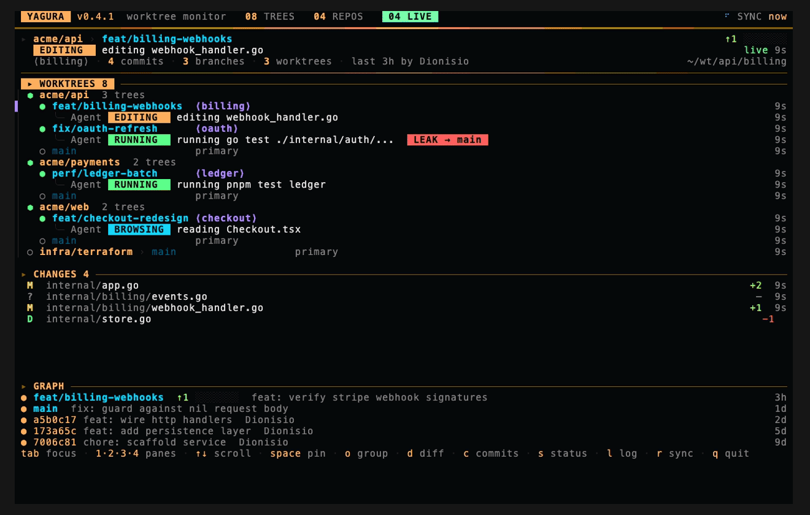
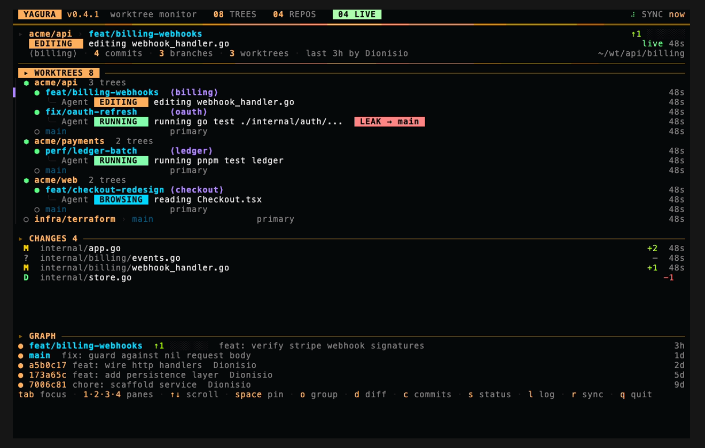

<div align="center">


# yagura

**A read-only watchtower for the AI coding agents working across all your git worktrees.**

[](https://github.com/zeroblack/yagura/actions/workflows/ci.yml)
[](https://github.com/zeroblack/yagura/releases)
[](LICENSE)
[](go.mod)
[](#install)



</div>

## What is yagura?

You run several AI coding agents at once — each in its own worktree, often across
more than one repository. Then you lose the thread. *Which agent is on which branch?
What is each one doing right now? Did that one just edit the wrong tree?*

`yagura` (櫓, "watchtower") answers that at a glance. It discovers every git
repository under one or more root directories, lists all of their worktrees, and shows
the agent running in each — live, ordered by activity, in a single console view.

It doesn't create worktrees and it doesn't launch agents. **It watches the ones you
already have.** Every other tool in this space *drives* parallel agent work; yagura is
the pane you leave open beside them to *see* it. Read-only by design — it never runs a
git command that writes — so it's safe to keep on screen all day.

## See every agent, at a glance

- **Live status per agent** — `RUNNING`, `EDITING`, `BROWSING`, `THINKING` — inferred
  from the last tool each one used, shown as a filled chip.
- **What it's doing, on its own line** — a full-width sub-line under each worktree
  spells out the current action: *running go test ./...*, *editing webhook_handler.go*.
- **Activity-ranked** — busy worktrees rise to the top, idle work fades, only live work
  is loud. Pin one with `space` to keep it in place.
- **Header you can read from across the room** — trees, repos, and how many agents are
  live this second.

## Multi-repo by default, zero config

- Point it at one or more root directories; it finds **every git repo underneath** —
  monorepo and many-repos alike, in one view.
- **No hooks, no instrumentation, no daemon.** It reads what is already on disk. Nothing
  to install into your agents, nothing to wire up.
- Group by repository or flatten everything into a single activity stream with `o`.

## A git inspector for each worktree



- **CHANGES**, **GRAPH** and **PR** panes for the selected worktree, without leaving the
  view — uncommitted files, the commit graph, and pull-request state side by side.
- `git status`, `diff --stat` and recent commits on demand (`s` / `d` / `c`), colorized.
- **Ahead/behind** divergence and **PR status badges** via the GitHub CLI (`gh`), cached.
- An **attention banner** surfaces branches that need action.

## A hazard you can't see anywhere else

`yagura` attributes each agent to its *home* worktree — the working directory it is
actually running in — and watches where its edits land. When an agent writes files into
a **different worktree of the same repo**, yagura flags a `[ LEAK → branch ]` chip.

That cross-contamination is the quiet failure mode of parallel agent work: one agent
clobbering another's tree while every dashboard still shows green. yagura is the only
tool that makes it visible.

## Built to leave open

- **Read-only.** It never mutates a repository. No accidental checkout, no surprise reset.
- **Never blocks.** Every scan, git call and file read runs off the UI thread with a
  per-command timeout, so a hung repo (a network mount, a credential prompt, a stale lock)
  can't freeze the view. An idle tick is just a `stat()`.
- **Light on huge repos.** Agent transcripts that grow to hundreds of megabytes are read
  from the tail, with an mtime cache — not re-parsed every tick.
- **NERV/MAGI instrument-panel aesthetic** — amber for the system, cyan for data, green
  for live, red for hazard — tuned so a calm baseline lets only live work draw the eye.
  Truecolor degrades to 256 colors automatically.

## Install

```sh
# Homebrew
brew install zeroblack/tap/yagura

# Go
go install github.com/zeroblack/yagura/cmd/yagura@latest
```

Or grab a binary from the [releases page](https://github.com/zeroblack/yagura/releases).
macOS and Linux are supported.

## Usage

```sh
yagura              # the live TUI (full-screen)
yagura list --json  # headless listing of worktrees + agents (scriptable)
yagura doctor       # validate toolchain and config
```

With no config, `yagura` watches the current directory. To watch fixed folders, create
`~/.config/yagura/config.yaml`:

```yaml
roots:
  - ~/Project/acme/services
  - ~/Project/acme/web
max_depth: 4
ignore: [node_modules, vendor, dist, .next, target, .venv]
agents:
  claude_root: ~/.claude/projects
  active_window: 10m
  tool_timeout: 30s
refresh:
  tick: 5s
theme: evangelion
```

Everything is configurable — roots, depth, refresh cadence, git timeouts, agent windows,
forge integration, theme, and every keybinding. See
[`config.example.yaml`](config.example.yaml) for the full surface.

## Keybindings

| Key                         | Action                                                  |
| --------------------------- | ------------------------------------------------------- |
| `↑ ↓` `j k`                 | move selection / scroll the focused pane                |
| `tab` `]` / `shift+tab` `[` | cycle pane focus                                        |
| `1` `2` `3` `4`             | jump to the worktrees / changes / graph / PR pane       |
| `space`                     | pin the focused worktree to the top (immune to re-sort) |
| `o`                         | toggle group-by-repo / flat-by-activity                 |
| `s` `d` `c` `l`             | status / diff / commits / agent log of the selection    |
| `esc`                       | close detail panel                                      |
| `r`                         | force refresh                                           |
| `q` `ctrl+c`                | quit                                                    |

Every binding is remappable under `keys:` in the config file; unset actions keep their
defaults.

## How agent detection works

Today, yagura detects [**Claude Code**](https://www.anthropic.com/claude-code) agents.
Support for other coding agents will be added over time — the agent source is a small
interface, designed for exactly that.

`yagura` reads Claude Code session transcripts under `~/.claude/projects/**/*.jsonl` and
groups them by the working directory recorded *inside* each transcript (the encoded folder
name under `~/.claude/projects` is lossy). Liveness comes from **transcript freshness** —
Claude Code doesn't hold its `.jsonl` open, so the robust signal that an agent is working
is that its transcript is being written *now*. The current activity is inferred from the
last tool in use, and the session is placed under its **home** worktree by the directory
it is running in (the edit path defines the leak, never a read). No `ps`, no `lsof`, no
hooks. macOS and Linux are supported.

## Scope

`yagura` is, deliberately, **only an observatory**:

- It does **not** create, move, lock or remove worktrees.
- It does **not** spawn, attach to, or control agents.
- It does **not** commit, push, merge, or run any git command that writes.

For creating and orchestrating worktrees-per-agent, reach for a dedicated manager. yagura
is what you keep open next to it — the one view that tells you, across every repo, where
each agent is and what it's doing right now.

## Development

```sh
make test     # go test -race
make lint     # gofmt + go vet + staticcheck
make audit    # govulncheck
make build    # ./bin/yagura
make snapshot # local goreleaser build
```

See [`CONVENTIONS.md`](CONVENTIONS.md) for the layout and code rules.

## License

Apache-2.0. `yagura` reuses patterns and the agent-session detection approach from
[lazyworktree](https://github.com/chmouel/lazyworktree) (also Apache-2.0); see
[`NOTICE`](NOTICE).
